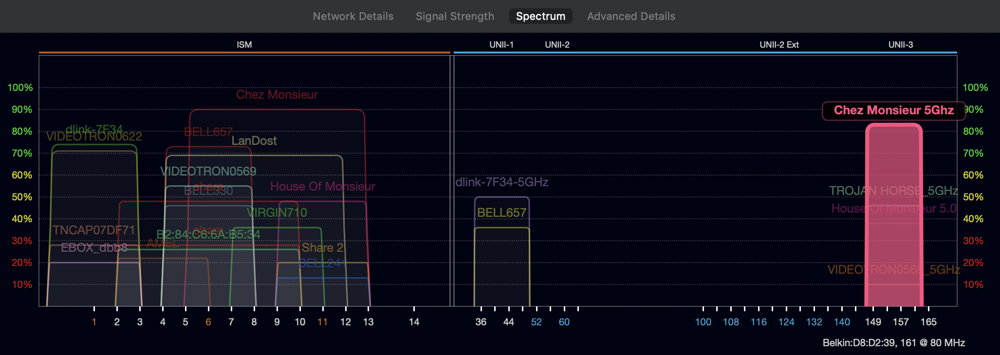
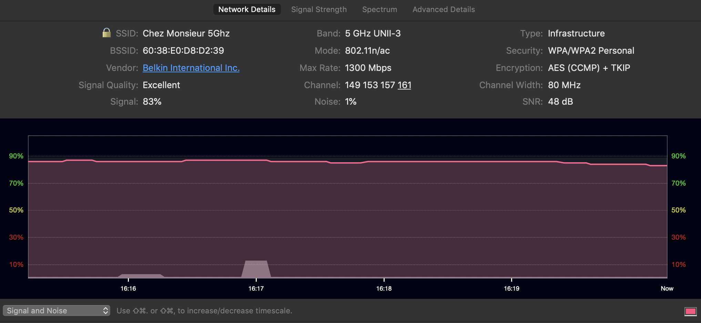
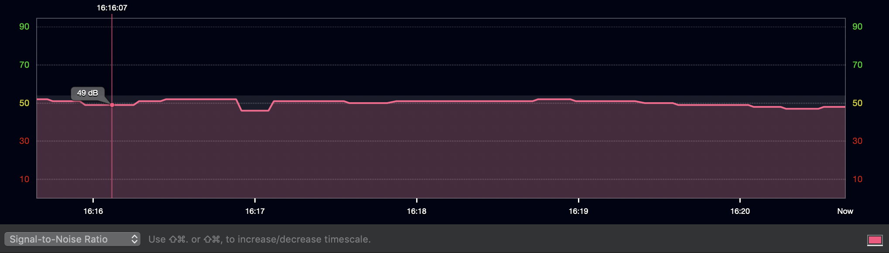

# WRT1900ACS Linksys firmware

```
Factory Reset

WPS off

Initializing QOS system seems to work around firmware bug:
Media Prioritization on (Downstream bandwidth 0, WMN on, No ack off)
Troubleshooting - Diagnostics - Reset router
Media Prioritization off
Troubleshooting - Diagnostics - Reset router

Wifi settings - 5 Ghz band - WPA2 Personal - Channel 161 - 802.11ac only - 80 Mhz
Wifi settings - 2.4 Ghz band - WPA2 Personal - auto - mixed  - auto

Option + macos wifi tray icon 
TX Rate: 1300 mbps
PHY mode: 802.11ac
Channel 161, 5ghz, 80mhz

Macos on 1000Mbit ethernet -> macbook pro 802.11ac

[sc@mbp ~/scratch]$ rm manj*; rsync -avP w@192.168.1.181:~/Downloads/manj* .
  1371013120  68%   27.04MB/s    0:00:22

Router usb drive -> macbook pro 802.11ac

[sc@mbp ~/scratch]$ rsync -avP /Volumes/usbkey/Qubes-R4.0-x86_64.iso .
    59539456   5%   14.03MB/s    0:01:10
```





```
Analysis:

Only the 2 non-DFS channels (42, 155) are used for VHT (80mhz) operation.

DFS channels (58, 106, 122, 138) are completely unused.
```


# Reference

brew cask install wifi-explorer

- [802.11ac channel numbering](http://www.revolutionwifi.net/revolutionwifi/2013/03/80211ac-channel-planning.html)
- [Practical intro to DFS](https://www.adriangranados.com/blog/practical-intro-dfs)
- [Automate DFS channel reversion](https://forum.openwrt.org/t/dfs-radar-detection-channel-recovery-hostapd/14238/5)
- [Arch router](https://blog.tjll.net/building-my-perfect-router/)
- [Apple guidelines](https://support.apple.com/en-ca/HT202068)